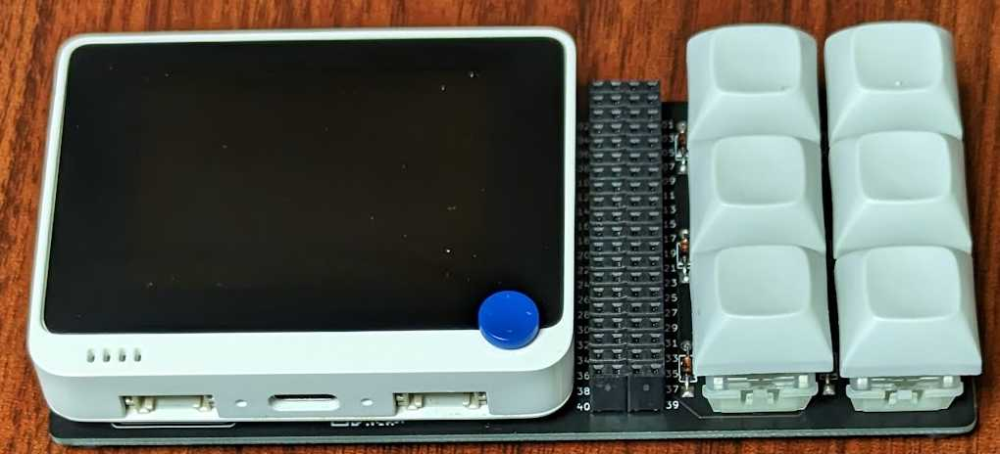
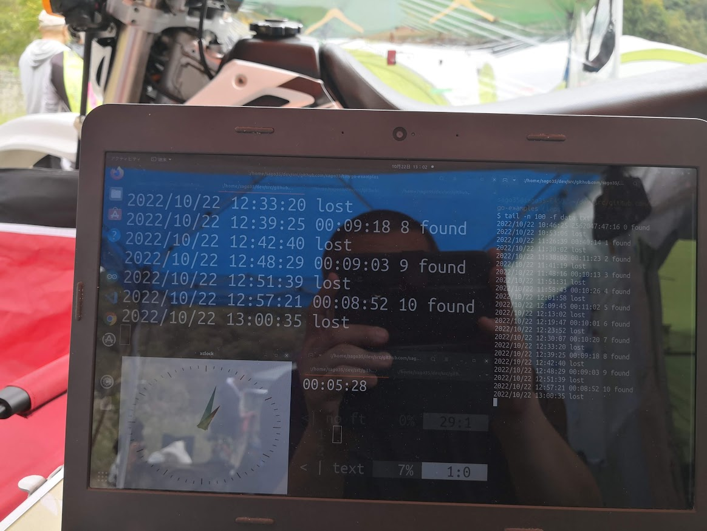

# TinyGo examples

## wioterminal goroutines

TinyGo example of wioterminal.  
https://github.com/sago35/tinygo-examples/tree/main/wioterminal/goroutines  

## wioterminal sample

TinyGo example of wioterminal.  
https://github.com/sago35/tinygo-examples/tree/main/wioterminal/sample  

## wioterminal USB  HID Keyboard

Using tinygo-keyboard, wioterminal becomes a USB HID Keyboard.  
Keymap settings can be changed from a web browser using Vial.

* [wiokey](https://github.com/sago35/tinygo-keyboard) example can also be run on wioterminal alone
    * https://vial.rocks/

## wioterminal other examples

There are many examples below.

* [./wioterminal/](./wioterminal/)
    * [./wioterminal/buttons/](./wioterminal/buttons/)
    * [./wioterminal/buzzer/](./wioterminal/buzzer/)
    * [./wioterminal/goroutines/](./wioterminal/goroutines/)
    * [./wioterminal/gpio/](./wioterminal/gpio/)
    * [./wioterminal/ir/](./wioterminal/ir/)
    * [./wioterminal/light_sensor/](./wioterminal/light_sensor/)
    * [./wioterminal/lis3dh/](./wioterminal/lis3dh/)
    * [./wioterminal/microphone/](./wioterminal/microphone/)
    * [./wioterminal/mqtt/](./wioterminal/mqtt/)
    * [./wioterminal/qspi_flash/](./wioterminal/qspi_flash/)
    * [./wioterminal/sample/](./wioterminal/sample/)
    * [./wioterminal/usbcdc/](./wioterminal/usbcdc/)
    * [./wioterminal/webclient/](./wioterminal/webclient/)

## xiao-ble examples

TinyGo example of XIAO BLE.  
This is a Demo using Bluetooth.  

* [./xiao-ble/](./xiao-ble/)

* [./xiao-ble-laptimer/](./xiao-ble-laptimer/)

## wioterminal initialize

`initialize.Wifi(ssid, password)` initializes RTL8720DN and configures WiFi.

* [./wioterminal/initialize/](./wioterminal/initialize/)

## pinintterrupt

Example of combining pin interrupts and goroutine in TinyGo.  
https://github.com/sago35/tinygo-examples/tree/main/pininterrupt  

## DeviceID / Serial Number

This is an example of reading the DeviceID.  
In other words, it is an example of reading data from a specific address of a microcontroller.  

* [./deviceid/](./deviceid/)

The following microcontrollers are supported.  

* atsamd51
* atsamd21
* nrf52840
* stm32f405

## LICENSE

MIT
